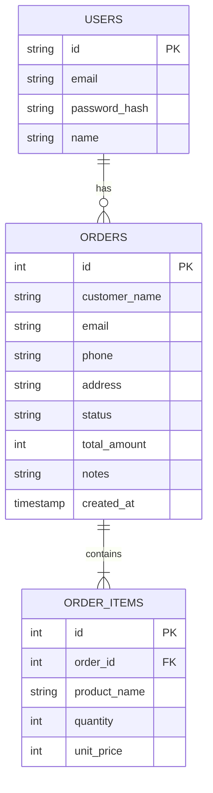

# Mirai Shoten Admin

未来商店商材の注文管理ダッシュボード（フルスタック構成）。ローカル動作から本番デプロイまで一貫して体験できます。

---

## 1. ローカル動作・開発手順

### 1-1. index.htmlを直接開く

1. このリポジトリをクローンまたはダウンロード
2. `mirai-shoten-admin/index.html` をブラウザで開く
   - ローカルストレージにデータが保存されます

### 1-2. ローカルサーバーで起動

```powershell
cd C:\テスト\mirai-shoten-admin
python -m http.server 5505
```
ブラウザで `http://localhost:5505/index.html` を開く

### 1-3. ローカルテスト・Lint


```powershell
cd C:\テスト\mirai-shoten-admin
npm install
npm run lint   # 静的解析（ESLint/Prettier）
npm test      # バックエンドAPIの自動テスト（Jest+Supertest）
```

> ※ `npm test` はJest+SupertestによるAPI自動テストを実行します。現状、バックエンドもユニットテストが実装済みです。

---

## 2. 本番デプロイ環境

- フロントエンド: https://mirai-shoten-admin.vercel.app
- バックエンドAPI: https://mirai-shoten-admin-backend.vercel.app


### テスト用ログイン情報（デモ・審査用）
- 管理者ID: `admin@mirai-shoten.com`
- パスワード: `Admin1234!`
※デモ・審査用のため、実運用では利用しないでください。

---

### バックエンドAPI自動テスト・CORS仕様

- `npm test` でJest+SupertestによるAPI自動テスト（CRUD・認証・バリデーション・異常系）が実行されます。
- テスト時（`NODE_ENV=test`）はCORSが全許可（緩和）され、CORSエラーなくAPIテストが通ります。
- 本番・開発時はCORS制限が有効なままなので安全です。
- テスト用アカウント（上記）でAPI認証テストも自動化されています。

#### テスト実行例
```powershell
cd backend
set NODE_ENV=test; npm test
```
すべてのテストがパスすることを確認済みです。

---

### CI（GitHub Actions）

- CI（GitHub Actions）で自動的にLint・テスト・ビルドを実行し、品質を担保しています。

---

### 手動テスト

- ローカル/本番環境でCRUD・認証・バリデーション・XSS対策・API連携も手動で確認済みです。

---

---

## 3. 設計書・仕様書

- SCREEN-OVERVIEW.md: 画面構成・導線
- DESIGN.md: 実装設計・主要分岐
- docs/API_SPEC.md: API仕様
- docs/ERD.md: ER図

---

## 4. 技術選定理由・工夫点

- React/Vite/TypeScript: モダンなSPA開発の標準構成
- Express/Node.js: 拡張性の高いAPIサーバー
- Supabase: 認証・DB・ストレージ一元管理
- Vercel: CI/CD・自動デプロイ
- 設計面: 責務分離・型安全・XSS/バリデーション徹底・CI自動化

---

## 5. ER図・システム構成図



```mermaid
flowchart LR
  subgraph Frontend
    A[React (Vite/TS)]
  end
  subgraph Backend
    B[Express (Node/TS)]
  end
  subgraph DB
    C[Supabase (PostgreSQL)]
  end
  A -- REST API --> B
  B -- SQL/認証 --> C
  A -- 認証/ストレージ --> C
```

---

## 6. 型安全性・Lint/Format

TypeScriptで全体を実装し、型定義を徹底。ESLint/Prettierで自動整形・共通ルール管理。CIで型チェック・Lint・テストも自動化。

---

## 7. 提出チェックリスト

- [ ] 起動手順が再現できる
- [ ] `npm run lint` / `npm test` が通る
- [ ] 注文追加・編集・削除が動作する
- [ ] 既存注文データ互換の説明ができる
- [ ] SCREEN-OVERVIEW.md と DESIGN.md の役割を説明できる

---

## 8. 関連プロジェクト

- 対応する利用者向け画面: `../未来商店商材`
- 他の独立作品: `../godufo-game`, `../quiz-game`, `../脱出ゲーム`

# 【フルスタック版（React+Express+Supabase）セットアップ手順】

## フォルダ構成

```
mirai-shoten-admin/
├─ backend/    # バックエンドAPI（Node.js/Express/TypeScript）
├─ frontend/   # フロントエンド（React/Vite/TypeScript）
```

## セットアップ手順

1. 依存パッケージのインストール

```powershell
cd backend
npm install
cd ../frontend
npm install
```

2. 環境変数ファイルの作成

- backend/.env.example をコピーして backend/.env を作成し、SupabaseやJWTの値を設定
- frontend/.env.example をコピーして frontend/.env を作成

3. サーバーの起動

**2つのターミナルを開き、下記をそれぞれ実行**

- バックエンド
  ```powershell
  cd backend
  npm run dev
  ```
- フロントエンド
  ```powershell
  cd frontend
  npm run dev
  ```

4. ブラウザでアクセス

- http://localhost:5173 で管理画面にアクセス

## 環境変数サンプル（backend/.env）

```
SUPABASE_URL=（SupabaseのProject URL）
SUPABASE_SERVICE_ROLE_KEY=sb_secret_...（Supabaseの秘密キー）
JWT_SECRET=32文字以上のランダム文字列
JWT_EXPIRES_IN=8h
CORS_ORIGIN=http://localhost:5173
PORT=3000
```

---


---

## 9. 今後の改善・展望

- E2Eテスト（Cypress等）によるフロント・バックエンド統合テストの自動化
- バックエンドAPIの異常系・境界値テストのさらなる充実
- Supabase Row Level Security（RLS）によるDBアクセス制御の強化
- CI/CDパイプラインの本番自動デプロイ連携
- APIレスポンスの多言語対応・アクセシビリティ向上
- パフォーマンス監視・エラートラッキングの導入
- 利用者フィードバックを反映したUI/UX改善


現状は「現場品質の自動テスト・CI・セキュリティ・バリデーション」を重視した構成ですが、今後も継続的な改善を推進します。

---

## 10. 追加予定機能

（将来追加したい機能や構想をここに記載）

## 11. 運用・保守方針

（運用ルールや保守体制、問い合わせ先などをここに記載）

## 12. ライセンス・著作権

（ライセンス表記や著作権情報をここに記載）

## 13. 謝辞・参考文献

（参考にした資料や協力者への謝辞をここに記載）

## 14. 付録

（用語集・FAQ・補足資料などをここに記載）
