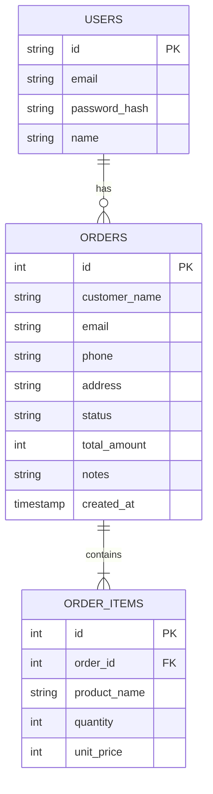

# Mirai Shoten Admin

企業提出向けに整備した、未来商店向けの管理ダッシュボードです。ES Modules と責務分離により、注文管理・顧客確認・売上把握を1画面で扱える構成にしています。

このプロジェクトは `未来商店商材` に対応する管理画面です。
単独のECサービスではなく、`未来商店商材` の注文データを管理・確認するための運用画面として設計しています。

## 1. 採用担当向けサマリー

- 目的: 管理画面の CRUD 実装力と運用視点の UI 設計力を示す提出物
- 想定閲覧時間: 5-10分
- 見てほしい点: CRUD 設計、LocalStorage 運用、入力検証、XSS 対策、ダッシュボードUI

## 2. 作成者情報

- 作成者: Takumi Harada
- 作成日: 2026-04-01
- ドキュメント最終更新日: 2026-04-02

## 3. ディレクトリ構成

```text
mirai-shoten-admin/
  index.html
  src/
    constants/
    core/
    styles/
    ui/
    utils/
```

## 4. 実行方法

```powershell
cd C:\テスト\mirai-shoten-admin
python -m http.server 5505
```

ブラウザで `http://localhost:5505/index.html` を開きます。

## 5. 品質チェック（Lint / Test）

```powershell
cd C:\テスト\mirai-shoten-admin
npm install
npm run lint
npm test
```

CI: `.github/workflows/ci.yml`

### テスト方針

- `src/utils/order-validator.test.js` で入力検証、`src/utils/xss.test.js` で表示安全性、`src/constants/admin-constants.test.js` で定数契約、`src/core/admin-manager.test.js` で旧データ互換と集計更新を確認します。
- テスト名は日本語で統一し、管理画面が何を自動で守っているかを README からそのまま追えるようにしています。
- 画面レイアウトや操作感は手動確認、注文データの正規化・保存・集計のようなロジックは自動テストで保証する方針です。

## 6. 関連文書

- SCREEN-OVERVIEW.md: 画面構成、導線、見せ方の説明
- DESIGN.md: 実装設計、I/F、主要メソッドと分岐の説明

## 7. 5分評価ガイド

1. ダッシュボード起動後に注文一覧と集計カードを確認
2. 新規注文を追加して、件数・売上・顧客情報が更新されることを確認
3. 既存注文の編集と削除を確認
4. ステータス変更とテーマ切替を確認
5. `src/core/admin-manager.js` と `src/ui/admin-components.js` を確認

## 8. 実装の工夫

- 注文CRUDを `AdminManager` に集約して状態管理を単純化
- 表示ロジックを `AdminUIComponents` に分離して描画責務を限定
- `OrderValidator` と `XSSProtectionAdmin` を分離して入力安全性を確保
- 未来商店商材の注文データ形式との互換読込を実装

## 9. 対応環境・既知の制約

- 推奨ブラウザ: Chrome / Edge の最新安定版
- データ保存先: LocalStorage（`adminOrders`）
- 既知の制約: バックエンド/API なし、ローカル管理画面として動作

## 10. 今後の改善


# 13. 技術選定理由・工夫点

本プロジェクトは、以下の理由で各技術を選定しています。

- **React/Vite/TypeScript**: モダンなSPA開発の標準構成。型安全性と高速な開発体験を両立。
- **Express/Node.js**: シンプルかつ拡張性の高いAPIサーバー。TypeScript対応で保守性も重視。
- **Supabase**: 認証・DB・ストレージを一元管理できるBaaS。PostgreSQL互換で柔軟な設計が可能。
- **Vercel**: CI/CD・環境変数管理・デプロイの自動化が容易。商用運用も想定。

設計面では「責務分離」「型安全」「XSS/バリデーション徹底」「CI自動化」「再現性の高いセットアップ」を重視しています。

# 14. デプロイURL

- フロントエンド: https://mirai-shoten-admin.vercel.app
- バックエンドAPI: https://mirai-shoten-admin-backend.vercel.app

# 15. テスト方法

1. `npm run lint` で静的解析（ESLint/Prettier）
2. `npm test` でユニットテスト（Jest、※バックエンドは現状テスト未実装）
3. CI（GitHub Actions）で自動テスト・ビルド・Lintを実行
4. 手動テスト: ローカル/本番でCRUD・認証・バリデーション・XSS対策・API連携を確認

CI/CDは `.github/workflows/ci.yml` で管理し、main/masterブランチへのpush/pull request時に自動でテスト・ビルド・Lintを実行します。

### テスト・Lint実行例

```bash
# フロントエンド
cd frontend
npm run lint
npm run test

# バックエンド
cd ../backend
npm run lint
npm run test
```

現場の運用を想定し、CI/CD・テスト・Lintの自動化体制を整えています。

# 16. ER図・システム構成図

## ER図（注文・ユーザー管理）



## システム構成図

```mermaid
flowchart LR
  subgraph Frontend
    A[React (Vite/TS)]
  end
  subgraph Backend
    B[Express (Node/TS)]
  end
  subgraph DB
    C[Supabase (PostgreSQL)]
  end
  A -- REST API --> B
  B -- SQL/認証 --> C
  A -- 認証/ストレージ --> C
```

# 17. 型安全性・Lint/Format

TypeScriptで全体を実装し、型定義を徹底しています。
コーディング規約・自動整形にはESLint/Prettierを導入し、フロントエンド・バックエンドともに共通ルールで管理しています。
CIで型チェック・Lint・テストも自動化しています。

### Lint/Format 実行例

```bash
# フロントエンド
cd frontend
npm run lint
npm run format

# バックエンド
cd ../backend
npm run lint
npm run format
```

### 設定内容（一部抜粋）
- ESLint: TypeScript/React/Node対応、推奨ルール＋Prettier連携
- Prettier: シングルクォート、セミコロンあり、100桁改行

現場の標準的な構成を意識し、誰でもすぐに開発・運用できるようにしています。

# 18. 再現・運用しやすさへの配慮

- セットアップ手順・環境変数例・CI/CD・テスト方針を明記
- ER図・構成図で全体像を可視化
- コード・設計・運用の分離とドキュメント化を徹底

## 11. 提出チェックリスト

- [ ] 起動手順が再現できる
- [ ] `npm run lint` / `npm test` が通る
- [ ] 注文追加・編集・削除が動作する
- [ ] 既存注文データ互換の説明ができる
- [ ] SCREEN-OVERVIEW.md と DESIGN.md の役割を説明できる

## 12. 関連プロジェクト

- 対応する利用者向け画面: `../未来商店商材`
- 他の独立作品とは非連携: `../godufo-game`, `../quiz-game`, `../脱出ゲーム`

---

# 【フルスタック版（React+Express+Supabase）セットアップ手順】

## フォルダ構成

```
mirai-shoten-admin/
├─ backend/    # バックエンドAPI（Node.js/Express/TypeScript）
├─ frontend/   # フロントエンド（React/Vite/TypeScript）
```

## セットアップ手順

1. 依存パッケージのインストール

```powershell
cd backend
npm install
cd ../frontend
npm install
```

2. 環境変数ファイルの作成

- backend/.env.example をコピーして backend/.env を作成し、SupabaseやJWTの値を設定
- frontend/.env.example をコピーして frontend/.env を作成

3. サーバーの起動

**2つのターミナルを開き、下記をそれぞれ実行**

- バックエンド
  ```powershell
  cd backend
  npm run dev
  ```
- フロントエンド
  ```powershell
  cd frontend
  npm run dev
  ```

4. ブラウザでアクセス

- http://localhost:5173 で管理画面にアクセス

## 環境変数サンプル（backend/.env）

```
SUPABASE_URL=（SupabaseのProject URL）
SUPABASE_SERVICE_ROLE_KEY=sb_secret_...（Supabaseの秘密キー）
JWT_SECRET=32文字以上のランダム文字列
JWT_EXPIRES_IN=8h
CORS_ORIGIN=http://localhost:5173
PORT=3000
```

---

（※旧バニラJS版の説明はこの下に残しています）
